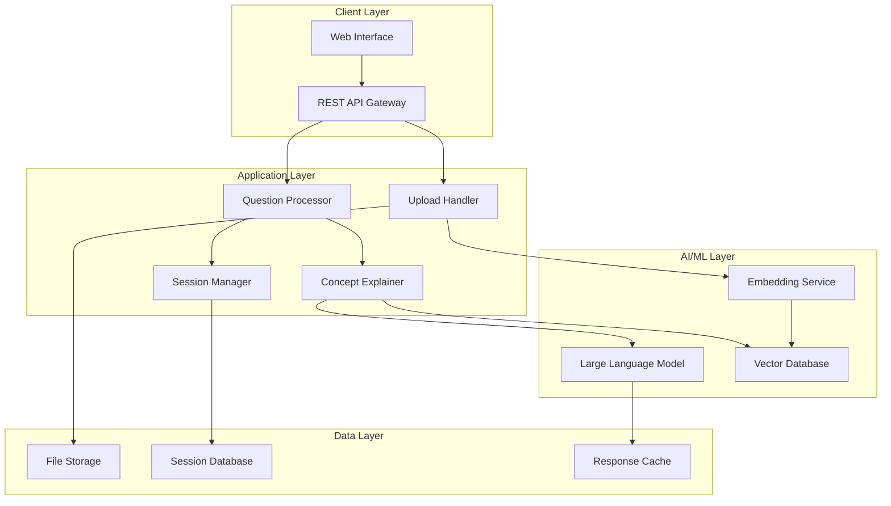

# Design Document: AI-Powered Learning Assistant

## Overview

The AI-powered learning assistant is an educational support system that combines natural language processing, document analysis, and machine learning to provide personalized learning experiences for students studying ML and data science concepts. The system follows a Retrieval-Augmented Generation (RAG) architecture, enabling it to ground responses in uploaded study materials while providing accurate, contextual explanations.

The system processes uploaded PDFs and datasets, maintains conversational context, and delivers educational content tailored to individual student needs. Key design principles include educational effectiveness, accuracy, and user-friendly interaction patterns optimized for learning workflows.

## Architecture

The system follows a modular RAG-based architecture with clear separation of concerns:



**Architecture Patterns:**
- **RAG (Retrieval-Augmented Generation)**: Combines document retrieval with generative AI for grounded responses
- **Microservices**: Modular components with clear interfaces and responsibilities
- **Event-driven**: Asynchronous processing for file uploads and analysis
- **Caching**: Multi-layer caching for performance optimization

## Components and Interfaces

### Upload Handler
**Responsibility**: Process and analyze uploaded study materials

**Key Methods:**
- `processFile(file: File) -> ProcessingResult`
- `extractText(pdfFile: File) -> TextContent`
- `parseDataset(csvFile: File) -> DatasetMetadata`
- `generateEmbeddings(content: TextContent) -> Vector[]`

**Supported Formats:**
- PDFs: Text extraction using PDF.js or similar library
- Datasets: CSV, JSON, Excel files with automatic schema detection
- File size limit: 50MB per upload

### Question Processor
**Responsibility**: Interpret natural language queries and coordinate responses

**Key Methods:**
- `processQuery(query: string, context: SessionContext) -> QueryIntent`
- `retrieveRelevantContent(intent: QueryIntent) -> RelevantContent[]`
- `generateResponse(intent: QueryIntent, content: RelevantContent[]) -> Response`

**Query Types:**
- Concept explanations ("What is gradient descent?")
- Dataset analysis ("What patterns do you see in my data?")
- Material-specific questions ("Explain this section of my PDF")
- Follow-up questions building on previous context

### Concept Explainer
**Responsibility**: Generate educational content appropriate for student learning

**Key Methods:**
- `explainConcept(concept: string, level: DifficultyLevel) -> Explanation`
- `generateAnalogy(concept: string) -> Analogy`
- `createExample(concept: string, context: StudentContext) -> Example`
- `suggestPrerequisites(concept: string) -> Concept[]`

**Educational Strategies:**
- Progressive disclosure: Start simple, add complexity as needed
- Analogies and real-world examples
- Visual explanations when appropriate
- Connection to uploaded materials

### Session Manager
**Responsibility**: Maintain conversation context and learning state

**Key Methods:**
- `createSession(studentId: string) -> SessionId`
- `updateContext(sessionId: SessionId, interaction: Interaction) -> void`
- `getContext(sessionId: SessionId) -> SessionContext`
- `summarizeSession(sessionId: SessionId) -> SessionSummary`

**Context Tracking:**
- Previous questions and responses
- Concepts already explained
- Student's demonstrated understanding level
- Uploaded materials and their analysis

### Vector Database Interface
**Responsibility**: Store and retrieve document embeddings for RAG

**Key Methods:**
- `storeEmbeddings(documentId: string, embeddings: Vector[]) -> void`
- `similaritySearch(queryVector: Vector, topK: number) -> SimilarDocument[]`
- `filterBySource(results: SimilarDocument[], sourceType: string) -> SimilarDocument[]`

## Data Models

### Student Session
```typescript
interface StudentSession {
  sessionId: string;
  studentId: string;
  createdAt: Date;
  lastActivity: Date;
  uploadedMaterials: UploadedMaterial[];
  conversationHistory: Interaction[];
  conceptsExplained: string[];
  currentContext: SessionContext;
}
```

### Uploaded Material
```typescript
interface UploadedMaterial {
  materialId: string;
  filename: string;
  fileType: 'pdf' | 'csv' | 'json' | 'xlsx';
  uploadedAt: Date;
  processingStatus: 'pending' | 'processing' | 'completed' | 'failed';
  extractedContent: TextContent | DatasetMetadata;
  embeddings: Vector[];
  summary: string;
}
```

### Query Intent
```typescript
interface QueryIntent {
  type: 'concept_explanation' | 'dataset_analysis' | 'material_question' | 'follow_up';
  concept?: string;
  difficulty: 'beginner' | 'intermediate' | 'advanced';
  referenceMaterials: string[];
  context: string;
  followUpTo?: string;
}
```

### Dataset Metadata
```typescript
interface DatasetMetadata {
  schema: ColumnInfo[];
  rowCount: number;
  summary: DatasetSummary;
  suggestedAnalyses: AnalysisType[];
  qualityIssues: QualityIssue[];
}

interface ColumnInfo {
  name: string;
  type: 'numeric' | 'categorical' | 'datetime' | 'text';
  nullCount: number;
  uniqueValues: number;
  statistics?: NumericStats | CategoricalStats;
}
```

### Educational Response
```typescript
interface EducationalResponse {
  explanation: string;
  examples: Example[];
  analogies: Analogy[];
  prerequisites: string[];
  nextSteps: string[];
  relatedConcepts: string[];
  sourceReferences: MaterialReference[];
}
```

## Correctness Properties

*A property is a characteristic or behavior that should hold true across all valid executions of a system—essentially, a formal statement about what the system should do. Properties serve as the bridge between human-readable specifications and machine-verifiable correctness guarantees.*

Based on the requirements analysis, the following properties ensure the system behaves correctly across all valid inputs and scenarios:

### Property 1: File Processing Completeness
*For any* valid file upload (PDF, CSV, JSON, Excel under 50MB), the Upload_Handler should successfully process the file and extract appropriate content (text for PDFs, structured data for datasets) without data loss.
**Validates: Requirements 1.1, 1.2, 1.4**

### Property 2: File Type Validation
*For any* uploaded file with an unsupported format or exceeding size limits, the Upload_Handler should reject the upload and return a clear error message indicating the specific issue and supported formats.
**Validates: Requirements 1.3, 1.5**

### Property 3: Multi-File Context Preservation
*For any* learning session with multiple uploaded files, queries referencing content from any uploaded material should receive responses that correctly identify and reference the appropriate source material.
**Validates: Requirements 1.6**

### Property 4: Natural Language Intent Recognition
*For any* natural language question within the system's domain, the Question_Processor should correctly classify the intent type (concept explanation, dataset analysis, material question, or follow-up) and extract relevant context.
**Validates: Requirements 2.1**

### Property 5: Material-Grounded Responses
*For any* question that relates to uploaded materials, the Learning_Assistant should include specific references to relevant content from those materials in its response.
**Validates: Requirements 2.2**

### Property 6: Ambiguity Handling
*For any* ambiguous or unclear question, the Learning_Assistant should request clarification rather than providing potentially incorrect responses.
**Validates: Requirements 2.3**

### Property 7: Session Context Continuity
*For any* learning session, the Learning_Assistant should maintain conversation context across all interactions, enabling coherent follow-up questions and building upon previous explanations.
**Validates: Requirements 2.4, 2.5, 5.1, 5.2**

### Property 8: Educational Content Structure
*For any* concept explanation, the response should be structured with clear steps when explaining processes, identify prerequisites when needed, and follow logical progression from basic to advanced concepts.
**Validates: Requirements 3.3, 3.5, 6.3**

### Property 9: Dataset Analysis Automation
*For any* uploaded dataset, the Learning_Assistant should automatically generate statistical summaries, identify patterns when queried, suggest appropriate ML techniques based on data characteristics, and connect findings to relevant educational concepts.
**Validates: Requirements 4.1, 4.2, 4.3, 4.4**

### Property 10: Code Example Validity
*For any* generated code example or pseudocode, the output should be syntactically correct for the specified language and follow established best practices.
**Validates: Requirements 4.5, 6.4**

### Property 11: Concept Tracking and Repetition Avoidance
*For any* learning session, the Learning_Assistant should track previously explained concepts and avoid unnecessary repetition while still building upon established knowledge.
**Validates: Requirements 5.3**

### Property 12: Session Length Management
*For any* learning session that exceeds a reasonable length threshold, the Learning_Assistant should offer to summarize key points and suggest logical stopping points or next steps.
**Validates: Requirements 5.4, 5.5**

### Property 13: Uncertainty Acknowledgment
*For any* query where the system has low confidence in its response accuracy, the Learning_Assistant should acknowledge limitations and suggest authoritative sources for verification.
**Validates: Requirements 6.2**

### Property 14: Comprehensive Error Handling
*For any* system error (upload failures, processing errors, technical issues), the Learning_Assistant should provide specific error messages, suggested solutions, and maintain conversation flow without losing context.
**Validates: Requirements 7.1, 7.2, 7.3**

### Property 15: User Guidance Provision
*For any* indication that a student is unsure how to interact with the system or requests help, the Learning_Assistant should provide clear usage tips, examples, and feature explanations.
**Validates: Requirements 7.4, 7.5**

### Property 16: Response Organization and Relevance
*For any* complex response, the Learning_Assistant should use appropriate formatting (headings, lists, structure), organize multi-part information logically, include relevant examples based on student context, and conclude with actionable next steps.
**Validates: Requirements 8.1, 8.2, 8.4, 8.5**

## Error Handling

The system implements comprehensive error handling across all components:

### Upload Processing Errors
- **File Format Errors**: Clear messages indicating unsupported formats with list of supported types
- **Size Limit Errors**: Specific feedback about file size limits and suggestions for compression
- **Corruption Errors**: Detection of corrupted files with guidance for re-upload
- **Processing Timeouts**: Graceful handling of long-processing files with status updates

### Query Processing Errors
- **Ambiguous Queries**: Clarification requests with suggested reformulations
- **Out-of-Scope Queries**: Polite redirection with explanation of system capabilities
- **Context Loss**: Recovery mechanisms to restore session state when possible
- **LLM Service Errors**: Fallback responses and retry mechanisms

### Data Analysis Errors
- **Invalid Dataset Structure**: Clear explanation of data format requirements
- **Missing Data Issues**: Guidance on handling null values and incomplete datasets
- **Analysis Failures**: Alternative analysis suggestions when primary methods fail
- **Visualization Errors**: Fallback to text-based summaries when charts fail

### Session Management Errors
- **Session Timeout**: Graceful session restoration with context preservation
- **Concurrent Access**: Proper handling of multiple simultaneous requests
- **Memory Limits**: Intelligent context pruning to maintain performance
- **Database Errors**: Temporary storage fallbacks and recovery procedures

## Testing Strategy

The testing approach combines unit testing for specific scenarios with property-based testing for comprehensive validation:

### Unit Testing Focus
- **Specific File Format Examples**: Test parsing of known PDF and dataset samples
- **Edge Cases**: Boundary conditions for file sizes, session lengths, and query complexity
- **Error Scenarios**: Specific error conditions and recovery mechanisms
- **Integration Points**: Component interactions and data flow validation

### Property-Based Testing Configuration
- **Testing Framework**: Use Hypothesis (Python) or fast-check (TypeScript) for property-based tests
- **Test Iterations**: Minimum 100 iterations per property test to ensure comprehensive coverage
- **Input Generation**: Custom generators for files, queries, datasets, and session states
- **Property Validation**: Each correctness property implemented as a separate property-based test

### Property Test Implementation
Each property test must be tagged with a comment referencing its design document property:
```
# Feature: ai-learning-assistant, Property 1: File Processing Completeness
# Feature: ai-learning-assistant, Property 7: Session Context Continuity
```

### Test Data Management
- **Synthetic Datasets**: Generated datasets with known characteristics for analysis testing
- **Sample PDFs**: Educational content samples for text extraction validation
- **Query Templates**: Parameterized question templates for natural language testing
- **Session Scenarios**: Pre-defined conversation flows for context testing

### Performance and Scalability Testing
- **Upload Performance**: File processing times across different sizes and formats
- **Response Latency**: Query processing and response generation timing
- **Concurrent Users**: Multi-session handling and resource management
- **Memory Usage**: Context storage and cleanup efficiency

The dual testing approach ensures both specific functionality validation through unit tests and comprehensive correctness verification through property-based testing, providing confidence in the system's reliability across all possible inputs and scenarios.
